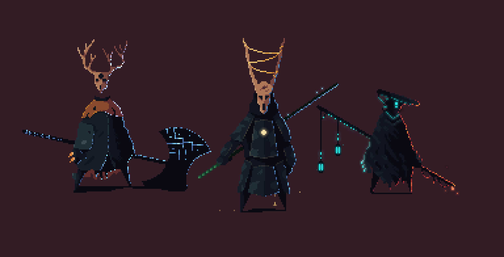

# Blog

## Intro

I've dabbled in game dev here and there over the years, nothing too serious but haven't really finished a game or gotten further than a superficial prototype. I quite like it as a creative outlet that still feels like it has some of the techincal aspects to it that I enjoy. As much as I know early game dev, especially as a solo indie dev, should be primitive shapes as prototypes before heavily working on any art, I'd like to pick an artistic style. I would prefer to not overlap a lot of my learning time and I'd prefer to carry on and devlop the skillset.

Because of that, I landed on low-poly art and pixel-art as potential options. I read many reddit posts and funnily enough, I couldn't find a concensus on what would be easier to work with as a solo dev. Low-poly seems to be harder to learn but more forgiving when it comes to reusing assets, making changes, lighting and so on. Pixel-art seems to come off as much easier to get something going while still having high barriers to amazing looking models, and extensive time required for projects with plenty of detailed animations. There is an exhaustive list of points for both sides, and while I think I would prefer to do low-poly 3D art I landed on giving both a try.

## Models

I'd like to make two things in both technologies and get them to a point of having reasonable features. For all of this I will be trying to stick to a medieval fantasy style. It would be preferable to not spend too much time on this but I will see where I get.

For the project I will make:

- Character
  - wields some weapon like a greatsword or halberd
  - wears a cape and some armour
  - has animations for
    - idle
    - walk
    - run
    - dash
    - light attack
    - heavy attack
    - block
    - take damage
    - death

- Object
  - small scouting party campsite including tents, fireplace, small supplies, ground, a tree and some bushes

## Works

### Pixel Art

For the pixel art, I very much prefer simpler designs, I found some art from [Alex Fomzie](https://www.behance.net/gallery/30709355/Pixel-warriors), I really like the silhouettes of his characters. I've also been following [penusbmic](https://penusbmic.itch.io/) for some time on Instagram, this person's work is probably my favourite style that I have found by far. I'd like to aim for something inspired by these in some way. I'm using the software [Aesprite](https://aseprite.org/) for the pixel art, including animation.

I got a little carried away adding some colour into the cloak and helmet to give a little life. I need to tweak the placement and size of the weapon but overall I think the maul type weapon is simple and I think looks quite nice.

I dont think I want to go too heavy on colours, I will do a quick sketch across parts of the model for highlights and such and then I will start splitting into an actual drawing with different layers so I can begin animation.

### Low Poly

==
